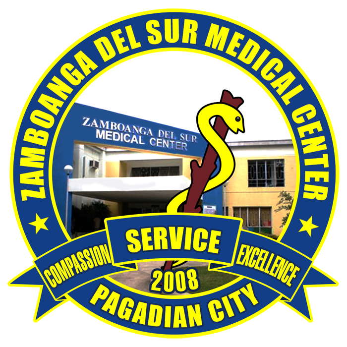

  

# Zamboanga del Sur Medical Center (ZDSMC)

## 🏥 About ZDSMC

**Zamboanga del Sur Medical Center (ZDSMC)** is a **Level 2 provincial government hospital** based in **Pagadian City**, committed to providing high-quality, accessible healthcare to the people of Zamboanga del Sur and surrounding areas.

## 💯 Zero Billing, 100% Public Service

ZDSMC proudly implements a **100% Zero Billing policy**, ensuring that patients receive essential medical services **at no cost** for covered procedures. This initiative is part of our mission to promote universal healthcare and relieve the financial burden of medical treatment for all.

## 🩺 Services Offered

- Inpatient & Outpatient Services  
- Emergency & Trauma Care  
- Surgical Services  
- Diagnostic & Laboratory Services  
- Maternal & Child Healthcare  
- Specialty Consultations  
- Public Health Programs  
<!-- 
## 🌟 Our Mission

To provide **compassionate, efficient, and inclusive** healthcare guided by the principles of public service, medical excellence, and social responsibility. -->

## 📍 Location

📌 **Pagadian City, Zamboanga del Sur, Philippines**

---

For more updates or inquiries, please contact the ZDSMC administrative office or follow us on our official social media channels.
